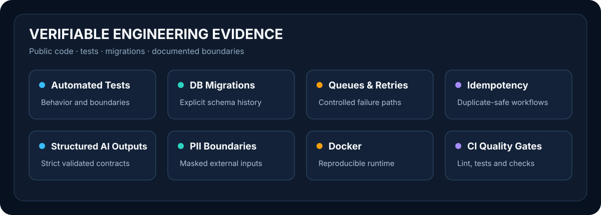

[Русский](README.md) | [English](README.en.md)

# Andrey Golovin

**Backend, Automation & AI Engineer**

I build backend services, automate business workflows and integrate AI into
practical business systems. My work emphasizes verifiable behavior: explicit
limitations, migrations, tests, safe data boundaries and predictable external
integrations.

## What I Build

- backend APIs for practical and internal systems;
- Telegram bots and automated workflows;
- API and CRM integrations;
- Excel and CSV processing pipelines;
- background jobs, queues and controlled retries;
- AI-assisted systems for business use cases;
- internal dashboards.

## Featured Projects

### Lead Gateway Platform

**Problem.** Ingest, validate and deliver batch records to an external API
without allowing a temporary failure to stop the whole job.

**Solution.** A FastAPI service with CSV/XLSX ingestion, validation and
normalization, scheduling and a PostgreSQL-backed queue.

**Engineering evidence.** A retry policy for temporary failures, rate limiting,
deterministic idempotency keys, an audit trail for every attempt, Docker runtime
and automated tests. The public edition uses synthetic data and a mock partner
API only.

**Stack.** Python, FastAPI, PostgreSQL, SQLAlchemy, Alembic, HTTPX, Docker, Pytest.

[Repository](https://github.com/Unequal1213/lead-gateway-platform) ·
[Case study](https://unequal1213.github.io/cases/lead-gateway-platform/)

### AI Support Copilot

**Problem.** Help a support operator obtain a structured classification,
priority, concise summary and reply draft without delegating autonomous
decisions to AI.

**Solution.** A FastAPI backend with a typed real LLM provider contract and an
offline deterministic provider behind the same interface.

**Engineering evidence.** Strict Structured Outputs with local validation, PII
masking before the external boundary, bounded repair/retry, transparent
deterministic fallback, audit metadata and PostgreSQL. The full verification
suite contains 141 tests; a separate controlled provider smoke used synthetic
data.

**Stack.** Python, FastAPI, PostgreSQL, SQLAlchemy, Alembic, Pydantic, OpenAI-compatible API, Docker, Pytest.

[Repository](https://github.com/Unequal1213/ai-ticket-assistant-api) ·
[Case study](https://unequal1213.github.io/cases/ai-support-copilot/)

## In Active Development

### Job Search Workflow Bot

A durable Telegram workflow with PostgreSQL state, user/chat isolation,
idempotent update processing, persisted rate limits, deterministic vacancy
analysis and template-based cover-letter drafts.

The current provider is deterministic and offline. A real LLM provider is
planned as a separate controlled phase.

[Repository](https://github.com/Unequal1213/ai-job-search-assistant-bot)

## Engineering Approach

- **Evidence before claims and explicit limitations.** AI Support documents the
  exact provider-smoke scope, while Job Bot states its current offline provider.
- **Tests and migrations.** Lead Gateway, AI Support and Job Bot include Pytest
  suites and explicit Alembic migrations; Task Manager tests task-ownership
  boundaries.
- **Predictable integrations.** Lead Gateway separates terminal and retryable
  outcomes, limits request rates and uses idempotency keys.
- **Safe data and logs.** AI Support masks detectable PII before the provider
  boundary; Job Bot does not persist raw vacancy text and tests its logging
  allowlist.
- **Reproducible delivery.** Docker configurations and CI quality gates validate
  projects before publication; new capabilities are added in separate,
  controlled phases.

## Technology Stack

- **Backend:** Python, FastAPI, SQLAlchemy, Alembic, Pydantic, HTTPX.
- **Data:** PostgreSQL; SQLite for tests.
- **Automation:** aiogram, schedulers, queues, API integrations, Excel/CSV pipelines.
- **AI:** OpenAI-compatible providers, Structured Outputs, PII masking, deterministic fallback.
- **Quality:** Pytest, Ruff, Playwright, accessibility checks, Docker, GitHub Actions.

## Verifiable Engineering Evidence

These categories are grounded in the code, tests and documentation of the
public projects. They are not an aggregate score and do not replace each
repository's stated limitations.

## Additional Projects

### Task Manager API

JWT authentication, Argon2 password hashing and tested per-user task isolation.

[Repository](https://github.com/Unequal1213/task-manager-api) ·
[All public repositories](https://github.com/Unequal1213?tab=repositories)

## Availability

Open to backend development, automation, Telegram bots, API integrations and
AI-assisted business systems.

## Contact

---

Practical systems that turn manual operations into controlled software
processes.
