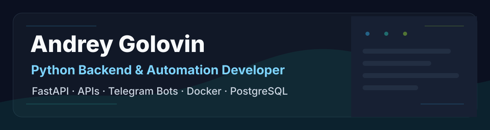
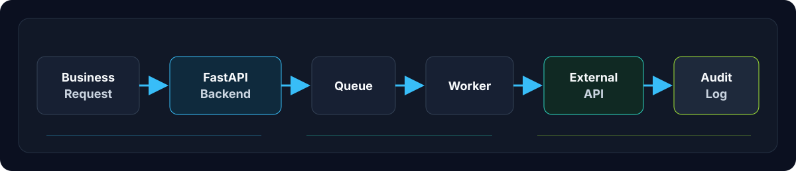
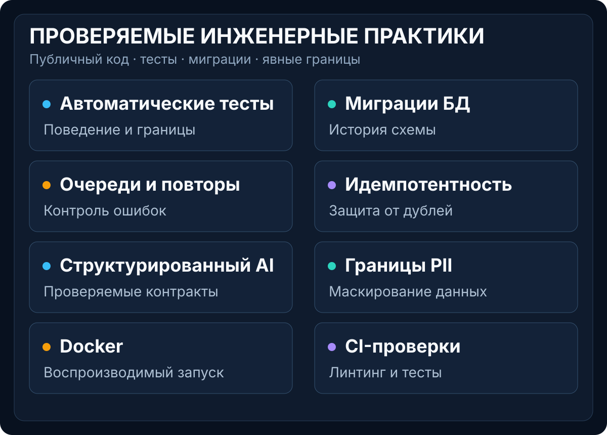

[Русский](README.md) | [English](README.en.md)

# Андрей Головин

**Backend-разработка, автоматизация и AI-решения для бизнеса**

Проектирую backend-сервисы, автоматизирую бизнес-процессы и интегрирую AI в
прикладные рабочие сценарии. В работе делаю упор на проверяемое поведение:
явные ограничения, миграции, тесты, безопасные границы данных и предсказуемые
интеграции с внешними системами.

## Что я разрабатываю

- backend API для прикладных и внутренних систем;
- Telegram-боты и автоматизированные рабочие процессы;
- интеграции с API и CRM;
- конвейеры обработки Excel и CSV;
- фоновые задачи, очереди и контролируемые повторы;
- AI-assisted системы для бизнес-сценариев;
- внутренние панели управления.

## Избранные проекты

### Lead Gateway Platform

**Задача.** Надёжно принимать пакетные данные, проверять их и доставлять записи
во внешнее API так, чтобы временный сбой не останавливал всю обработку.

**Решение.** FastAPI-сервис с CSV/XLSX ingestion, валидацией и нормализацией,
планированием и очередью на PostgreSQL.

**Инженерные особенности.** Retry policy для временных ошибок, rate limiting,
детерминированные idempotency keys, audit trail каждой попытки, Docker runtime и
автоматические тесты. Публичная версия использует только синтетические данные и
mock partner API.

**Стек.** Python, FastAPI, PostgreSQL, SQLAlchemy, Alembic, HTTPX, Docker, Pytest.

[Репозиторий](https://github.com/Unequal1213/lead-gateway-platform) ·
[Разбор проекта](https://unequal1213.github.io/cases/lead-gateway-platform/)

### AI Support Copilot

**Задача.** Помочь оператору поддержки получить структурированную классификацию,
приоритет, краткое резюме и черновик ответа без передачи AI автономных решений.

**Решение.** FastAPI backend с типизированным контрактом реального LLM provider
и offline deterministic provider за единым интерфейсом.

**Инженерные особенности.** Strict Structured Outputs и локальная валидация,
PII masking перед внешней границей, ограниченные repair/retry, прозрачный
deterministic fallback, audit metadata и PostgreSQL. Полная проверка включает
141 тест; отдельно выполнен контролируемый provider smoke на синтетических
данных.

**Стек.** Python, FastAPI, PostgreSQL, SQLAlchemy, Alembic, Pydantic, OpenAI-compatible API, Docker, Pytest.

[Репозиторий](https://github.com/Unequal1213/ai-ticket-assistant-api) ·
[Разбор проекта](https://unequal1213.github.io/cases/ai-support-copilot/)

## В активной разработке

### Job Search Workflow Bot

Durable Telegram workflow с состоянием в PostgreSQL, изоляцией пользователя и
чата, idempotent обработкой updates, сохраняемыми rate limits,
детерминированным анализом вакансий и шаблонными черновиками сопроводительных
писем.

Текущий provider является deterministic/offline. Реальный LLM provider
запланирован как отдельная контролируемая фаза.

[Репозиторий](https://github.com/Unequal1213/ai-job-search-assistant-bot)

## Инженерный подход

- **Evidence before claims, явные ограничения.** AI Support документирует точный
  scope provider smoke, а Job Bot прямо фиксирует текущий offline provider.
- **Тесты и миграции.** Lead Gateway, AI Support и Job Bot имеют Pytest-наборы и
  явные Alembic migrations; Task Manager тестирует границы владения задачами.
- **Предсказуемые интеграции.** Lead Gateway разделяет terminal и retryable
  outcomes, ограничивает частоту запросов и использует idempotency keys.
- **Безопасные данные и логи.** AI Support маскирует обнаруживаемые PII до
  provider boundary; Job Bot не сохраняет исходный текст вакансии и проверяет
  allowlist логов.
- **Воспроизводимая поставка.** Docker-конфигурации и CI quality gates проверяют
  проекты до публикации; новые возможности добавляются отдельными
  контролируемыми фазами.

## Технологии

- **Backend:** Python, FastAPI, SQLAlchemy, Alembic, Pydantic, HTTPX.
- **Data:** PostgreSQL; SQLite для тестов.
- **Automation:** aiogram, schedulers, queues, API integrations, Excel/CSV pipelines.
- **AI:** OpenAI-compatible providers, Structured Outputs, PII masking, deterministic fallback.
- **Quality:** Pytest, Ruff, Playwright, accessibility checks, Docker, GitHub Actions.

## Проверяемые инженерные доказательства

Эти категории опираются на код, тесты и документацию публичных проектов. Они не
являются объединённой статистикой и не подменяют ограничения конкретного
репозитория.

## Дополнительные проекты

### Task Manager API

JWT-аутентификация, Argon2-хеширование паролей и протестированная изоляция задач
между пользователями.

[Репозиторий](https://github.com/Unequal1213/task-manager-api) ·
[Все публичные репозитории](https://github.com/Unequal1213?tab=repositories)

## Доступность

Открыт к backend-разработке, автоматизации, Telegram-ботам, API-интеграциям и
AI-assisted бизнес-системам.

## Контакты

---

Практичные системы, которые превращают ручные операции в контролируемые
программные процессы.
